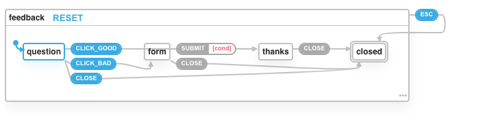

# Model-Based Testing with `@xstate/test` and React Demo

This is a React project bootstrapped with [Create React App](https://github.com/facebook/create-react-app). It demonstrates how to use `@xstate/test` with React to automate the generation of integration and end-to-end (E2E) tests of an example application.

## Running the Tests

To run the **integration tests**, run `npm test`. This will run the tests found in [`./src/App.test.js`](https://github.com/davidkpiano/xstate-test-demo/blob/master/src/App.test.js).

To run the **E2E tests**, run `npm run e2e`. This will run the tests found in [`./src/App.e2e.js`](https://github.com/davidkpiano/xstate-test-demo/blob/master/src/App.e2e.js).

NOTE: To run the **E2E tests** on a different port: `PORT=3001 npm run e2e`

## Resources

👀 See the [demo's state machine on the XState Visualizer](https://xstate.js.org/viz/?gist=8b1e4f0d66e66802cd8d24c65f37954c)

- [Github: `@xstate/test`](https://github.com/davidkpiano/xstate/tree/master/packages/xstate-test)
- [Slides: Write Less Tests! From Automation to Autogeneration](https://slides.com/davidkhourshid/mbt/) (React Rally 2019)
- [Article: Model-Based Testing in React with State Machines](https://css-tricks.com/?p=286484) (CSS-Tricks)
